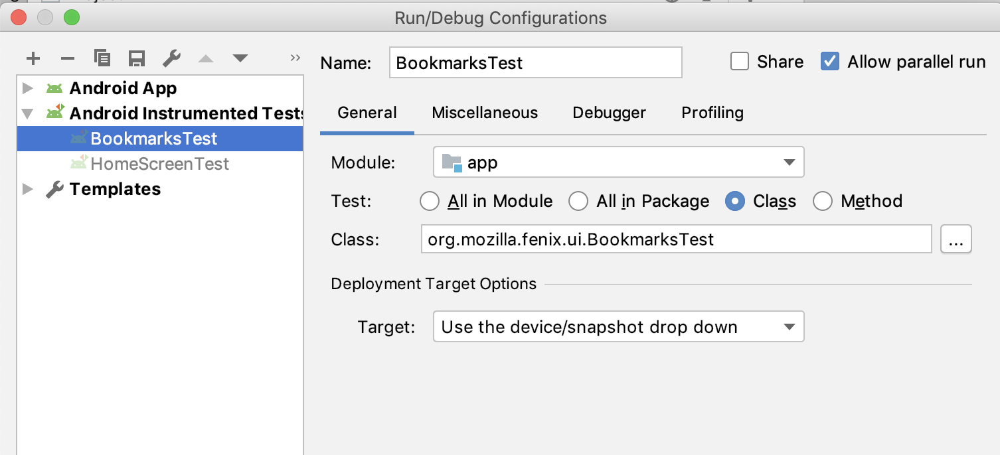

# Android Studio FAQ

## Build Issues

_What do I do if building in Android Studio fails (and the same version is building for everyone else)?_

_Try the following in this order:_

1. Verify the desired Build Variant is selected
2. Clean project then rebuild
3. Sync project with Gradle files
4. Invalidate Caches and Restart
5. Update Android Studio and Restart
6. Delete the Gen directory and rebuild
7. Wipe data on emulator
8. Delete the ```~/.gradle``` directory (see: Build Issue - Prevention below)
9. Wipe Android Studio cache ```rm -rf ~/.idea```
10. Wipe data on emulator

### Build Issue - Prevention
Mike’s Daily Routine for Build Issue Prevention

```git fetch up/master && git checkout up/master && ./gradlew clean assemblegeckobetafenixbeta```

If it fails to build (which isn't often):

```rm -rf ~/.gradle/caches```

**Notes:**

* Sometimes build failure is a legitimate build error 
* Re-building after clearing .gradle/caches may take over 10 minutes


## UI (Espresso) Tests


### ERROR: Class Not Found: Empty Test Suite
_If you receive, “Class Not Found: Empty Test Suite” (or related ActivityTestRule errors) on attempt to run individual tests from the project tree pane, you will need to change your Run configuration_

**Edit Configurations**

_Add a new test configuration manually_

* Go to: Run > Edit Configurations
* Select: "+" (icon) > “Android Instrumented Tests” (not Junit - which may be selected by default)
* Select the appropriate module from the drop-down list
* Select the "Class" option (to run all the tests in a class)
* Click the ... button and search for the specific class you want



* Hit OK button to exit the Run Configuration screen.
* Make sure your new configuration is selected and that it is showing the icon with an Android head. * This means it is an Android Instrumented Test, which is necessary for Espresso. Otherwise it will try (and fail) to run it as a regular JUnit test.
* Done! Now you should be able to run your tests.


## Emulators

### Emulator WIFI
_What do I do if my Emulator wireless connection stops working? (OSX)_

1. Press F8 
 * This can toggle on/off wireless connection on Macs
2. Go to System Preferences -> Advanced -> DNS 
3. Add: ‘8.8.8.8’ and ‘8.8.4.4’ to the DNS Servers list  (Add a DNS server)


